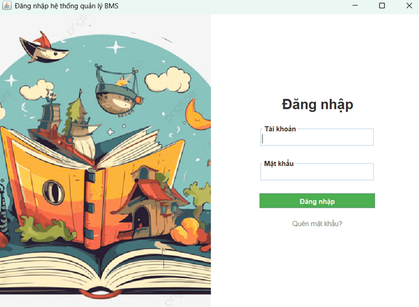
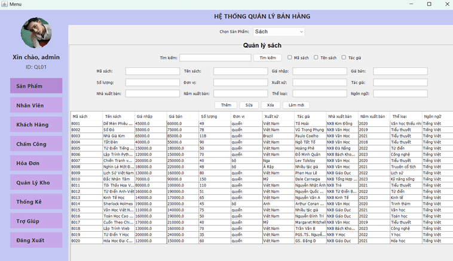
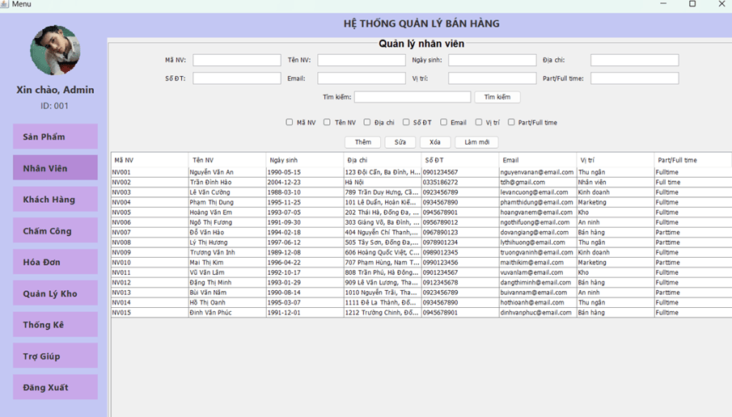
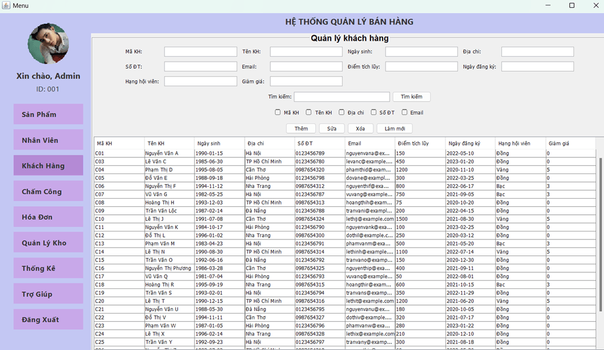
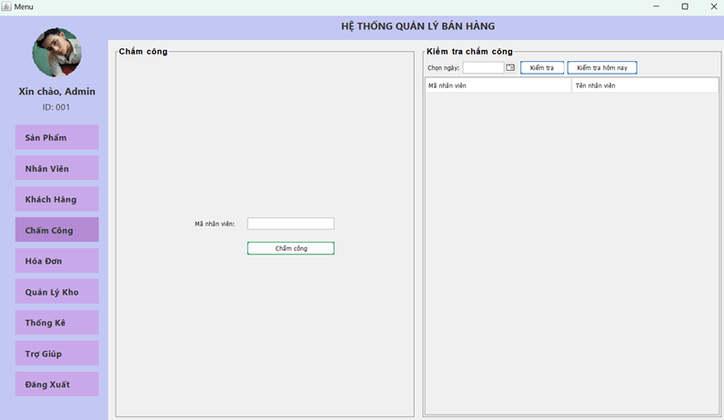
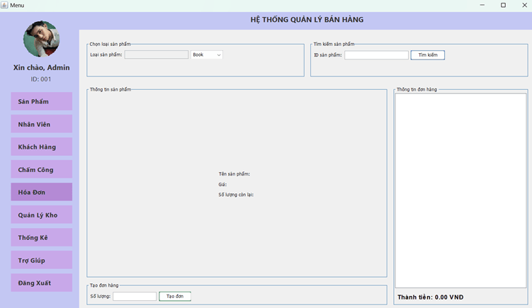
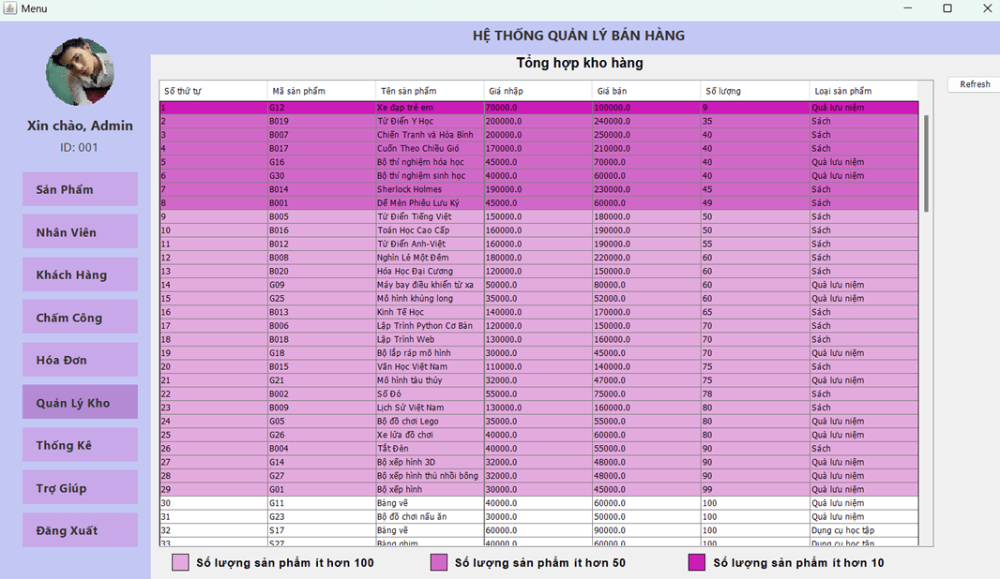
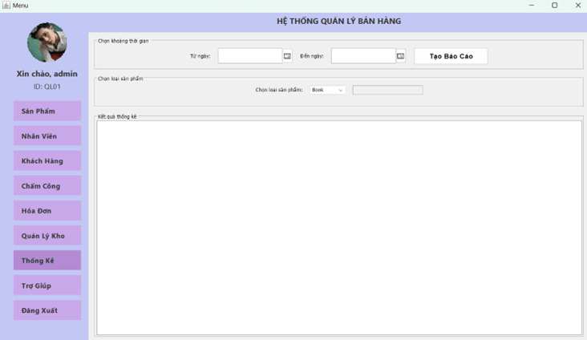

# 🏪 Hệ Thống Quản Lý Nhà Sách

Đây là bài tập lớn môn **Lập trình Hướng Đối Tượng (OOP)** tại Học viện Công nghệ Bưu chính Viễn thông - PTIT.  
**Sinh viên**: Trần Đình Hào - B22DCCN278  
**Giảng viên**: Nguyễn Mạnh Sơn | **Khóa**: D22  
📄 **Báo cáo**: [PDF](https://drive.google.com/file/d/18rdwKLn52ZTHDifiDIVfln72U-eSRIQV/view?usp=sharing) | [DOCX](https://docs.google.com/document/d/1CBE_-5cVg-rrDP0is8g_KoTHc92l3eux/edit?usp=sharing&ouid=113235621676813436249&rtpof=true&sd=true)

👉 *Cho tôi 1 ⭐ nếu bạn thấy hữu ích nhé, mình đã dành rất nhiều tâm huyết cho project này 😅*

---

## 📝 Giới thiệu

Hệ thống quản lý nhà sách giúp **tin học hóa quy trình quản lý** của các nhà sách truyền thống, hỗ trợ lưu trữ thông tin sản phẩm, khách hàng, nhân viên, hóa đơn… từ đó nâng cao hiệu suất và độ chính xác khi vận hành.

### Các vấn đề của quản lý thủ công:
- Khó tra cứu, tìm kiếm sản phẩm nhanh chóng
- Dễ nhầm lẫn khi cập nhật dữ liệu
- Tốn thời gian xử lý giao dịch
- Thiếu thống kê, báo cáo chính xác theo thời gian

### Giải pháp:
- Xây dựng phần mềm quản lý tập trung
- Số hóa toàn bộ nghiệp vụ nhà sách
- Tự động hóa các chức năng: thêm/sửa/xóa, thống kê, tìm kiếm, lọc dữ liệu…

---

## 🛠 Công nghệ sử dụng

- Java Core & Java Swing (Xây dựng giao diện và logic)
- JDBC (Kết nối CSDL)
- MySQL Database
- Apache NetBeans IDE 22
- Git & GitHub

---

## 🏗 Kiến trúc hệ thống

### Cấu trúc thư mục

```plaintext
bookstore-management/
├── connectDB/             # Kết nối cơ sở dữ liệu MySQL
├── giaodien/              # Giao diện người dùng (UI)
├── home/                  # Class khởi chạy chính
├── product/               # Quản lý sản phẩm
├── system_management/     # Các chức năng quản trị hệ thống
├── user/                  # Quản lý nhân viên, khách hàng
└── work/                  # Đăng nhập và xác thực người dùng
````

---

## ⚙️ Chức năng chính

### 1. Quản lý đăng nhập

* Xác thực tài khoản nhân viên

<div align="center">
  
</div>

---

### 2. Quản lý sản phẩm

* Thêm, sửa, xóa sách
* Tìm kiếm, lọc theo tên, mã sách

<div align="center">
  
</div>

---

### 3. Quản lý nhân viên

* Thêm, sửa, xóa thông tin nhân viên
* Tìm kiếm theo tên, mã, chức vụ

<div align="center">
  
</div>

---

### 4. Quản lý khách hàng

* Lưu thông tin khách hàng thân thiết
* Tìm kiếm, chỉnh sửa thông tin khách

<div align="center">
  
</div>

---

### 5. Chấm công

* Ghi nhận giờ làm việc nhân viên

<div align="center">
  
</div>

---

### 6. Hóa đơn

* Tạo hóa đơn bán hàng
* Quản lý danh sách hóa đơn, in hóa đơn

<div align="center">
  
</div>

---

### 7. Quản lý kho

* Theo dõi số lượng tồn
* Cập nhật nhập – xuất sách

<div align="center">
  
</div>

---

### 8. Thống kê doanh thu

* Thống kê theo ngày, tháng, năm
* Báo cáo doanh thu, sản phẩm bán chạy

<div align="center">
  
</div>

---

## 📦 Cài đặt & sử dụng

1. Clone project

   ```bash
   git clone https://github.com/your-username/bookstore-management.git
   ```

2. Import database

   * Mở MySQL Workbench
   * Import file [`bms.sql`](https://github.com/trandinhhao/Bookstore-Management-System/blob/master/bms.sql)

3. Cấu hình kết nối DB trong file `connectDB/ConnectMySQL.java`

4. Mở project bằng NetBeans IDE và chạy chương trình

---

## 📚 Tài liệu tham khảo

1. [Bài giảng Lập trình Hướng đối tượng - PTIT](https://bit.ly/ptit_oop)
2. [Java Swing Tutorial - Javatpoint](https://www.javatpoint.com/java-swing)
3. [Learn SQL Fast - SQLZoo](https://sqlzoo.net/)

---

## 📝 License

Dự án phục vụ mục đích học tập. Không sử dụng cho mục đích thương mại nếu không được cho phép.

```

---

👉 Nếu bạn cần mình tạo file `.md` để tải về hoặc muốn gộp thêm ảnh demo, just tell me!
```
